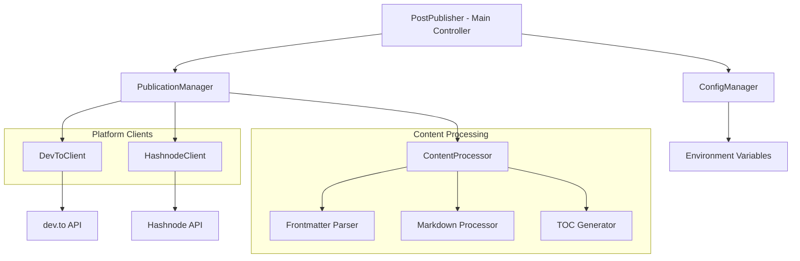

# Multi-Platform Content Publishing Engine Design

## Overview

This design extends the existing content publishing system to support multiple platforms (dev.to and Hashnode) while maintaining backward compatibility. The system will be refactored to use a plugin-based architecture that allows easy addition of new platforms, implements intelligent content change detection, and migrates to modern Python tooling with uv package management.

## Architecture

The system follows a layered architecture with clear separation of concerns:



## Components and Interfaces

### Core Interfaces

#### PlatformClient Interface
```python
from abc import ABC, abstractmethod
from typing import Dict, List, Optional, Tuple

class PlatformClient(ABC):
    @abstractmethod
    def publish_article(self, post_content: Dict, published: bool) -> Dict:
        """Publish a new article to the platform"""
        pass
    
    @abstractmethod
    def update_article(self, article_id: str, post_content: Dict, published: bool) -> Dict:
        """Update an existing article on the platform"""
        pass
    
    @abstractmethod
    def get_articles(self) -> List[Dict]:
        """Retrieve all articles from the platform"""
        pass
    
    @abstractmethod
    def get_article(self, article_id: str, published: bool) -> Optional[Dict]:
        """Retrieve a specific article by ID"""
        pass
    
    @abstractmethod
    def find_article_by_title(self, title: str) -> Tuple[Optional[str], Optional[bool]]:
        """Find article ID and publication status by title"""
        pass
```

### Component Responsibilities

#### PostPublisher (Main Controller)
- Orchestrates the entire publishing workflow
- Manages configuration and platform client initialization
- Handles file discovery and processing coordination
- Implements rate limiting and error recovery

#### PublicationManager
- Coordinates publishing across multiple platforms
- Implements content change detection logic
- Manages platform-specific transformations
- Handles partial failure scenarios

#### ContentProcessor
- Processes markdown files and frontmatter
- Generates table of contents
- Applies platform-specific content transformations
- Normalizes content for comparison

#### Platform Clients
- **DevToClient**: Existing client, refactored to implement PlatformClient interface
- **HashnodeClient**: New client implementing Hashnode GraphQL API integration

## Data Models

### PostContent Model
```python
@dataclass
class PostContent:
    title: str
    subtitle: str
    slug: str
    tags: List[str]
    cover: str
    domain: str
    save_as_draft: bool
    enable_toc: bool
    body_markdown: str
    canonical_url: str
    series_name: Optional[str] = None
    
    @classmethod
    def from_frontmatter(cls, frontmatter_data: Dict, body_markdown: str) -> 'PostContent':
        """Create PostContent from frontmatter and markdown body"""
        pass
```

### ArticleStatus Model
```python
@dataclass
class ArticleStatus:
    platform: str
    article_id: Optional[str]
    exists: bool
    published: bool
    needs_update: bool
    content_hash: str
    last_modified: Optional[datetime] = None
```

### PublicationResult Model
```python
@dataclass
class PublicationResult:
    platform: str
    success: bool
    action: str  # 'created', 'updated', 'skipped'
    article_id: Optional[str] = None
    error_message: Optional[str] = None
```

## Correctness Properties

*A property is a characteristic or behavior that should hold true across all valid executions of a system-essentially, a formal statement about what the system should do. Properties serve as the bridge between human-readable specifications and machine-verifiable correctness guarantees.*

Based on the prework analysis, here are the key correctness properties that ensure the multi-platform publishing system behaves correctly:

### Core Publishing Properties

Property 1: Existing article check precedence
*For any* publishing run with existing articles on platforms, the system should check for existing articles before attempting to create new ones
**Validates: Requirements 1.1**

Property 2: Content consistency across platforms
*For any* post content published to multiple platforms, the core content should remain identical while platform-specific formatting is applied appropriately
**Validates: Requirements 1.2**

Property 3: Update only on content changes
*For any* existing article, updates should only occur when content has actually changed since the last publication
**Validates: Requirements 1.3**

Property 4: Creation when no existing articles
*For any* post with no existing articles on a platform, a new article should be created on that platform
**Validates: Requirements 1.4**

Property 5: Error isolation between platforms
*For any* platform-specific error, other platforms should continue processing successfully and the error should be reported
**Validates: Requirements 1.5**

### Platform Integration Properties

Property 6: Hashnode data transformation
*For any* post data published to Hashnode, it should be correctly transformed into Hashnode's required JSON format
**Validates: Requirements 2.2**

Property 7: Frontmatter field mapping
*For any* frontmatter configuration, fields should be correctly mapped to appropriate platform-specific article properties
**Validates: Requirements 2.3**

Property 8: Article identification by title
*For any* article title, the system should correctly identify existing articles on platforms for update operations
**Validates: Requirements 2.4**

### Content Processing Properties

Property 9: Content change detection
*For any* article comparison, the system should detect differences in markdown content, publication status, tags, or metadata
**Validates: Requirements 3.3**

Property 10: Skip behavior for identical content
*For any* content that is identical between local and platform versions, the update should be skipped and logged appropriately
**Validates: Requirements 3.4**

Property 11: Platform-specific content transformation
*For any* content processed for Hashnode, HTML alignment attributes should be removed while dev.to formatting should be preserved
**Validates: Requirements 4.1, 4.2**

Property 12: Consistent TOC generation
*For any* markdown content, table of contents should be generated consistently for both platforms
**Validates: Requirements 4.3**

Property 13: Tag format conversion
*For any* frontmatter tags, comma-separated strings should be converted to appropriate platform-specific formats
**Validates: Requirements 4.4**

### System Behavior Properties

Property 14: Platform iteration completeness
*For any* configured set of platform clients, all enabled platforms should be processed during publication
**Validates: Requirements 5.3**

Property 15: Failure isolation
*For any* platform client failure, other platform clients should continue processing without interruption
**Validates: Requirements 5.4**

Property 16: Content normalization for comparison
*For any* content comparison, both local and platform content should be normalized by removing frontmatter and platform-specific formatting
**Validates: Requirements 6.1**

Property 17: Comprehensive change detection
*For any* change detection operation, title, content body, tags, publication status, and cover image should all be compared
**Validates: Requirements 6.2**

Property 18: Selective metadata updates
*For any* metadata-only changes (tags, title, cover image), only the changed fields should be updated
**Validates: Requirements 6.4**

### Error Handling Properties

Property 19: Detailed error logging
*For any* API request failure, detailed error messages should be logged including platform and article information
**Validates: Requirements 9.1**

Property 20: Rate limiting handling
*For any* rate limiting occurrence, appropriate delays and retry mechanisms should be implemented
**Validates: Requirements 9.2**

Property 21: Success logging completeness
*For any* successful publishing operation, success messages should be logged with article titles and platform names
**Validates: Requirements 9.4**

## Error Handling

The system implements comprehensive error handling at multiple levels:

### Platform-Level Error Handling
- **API Failures**: Retry logic with exponential backoff for transient failures
- **Authentication Errors**: Clear error messages with guidance for API key setup
- **Rate Limiting**: Automatic delays and retry mechanisms respecting platform limits
- **Network Issues**: Timeout handling and connection retry logic

### Content-Level Error Handling
- **Invalid Frontmatter**: Validation with helpful error messages
- **Missing Required Fields**: Clear indication of missing required metadata
- **Content Processing Errors**: Graceful degradation with partial content processing

### System-Level Error Handling
- **Configuration Errors**: Validation of environment variables and settings
- **File System Errors**: Proper handling of missing or inaccessible markdown files
- **Partial Failures**: Continue processing other platforms when one fails

## Testing Strategy

The system employs a dual testing approach combining unit tests and property-based tests:

### Unit Testing Approach
- **Component Testing**: Individual testing of each platform client, content processor, and manager
- **Integration Testing**: Testing interactions between components
- **Mock Testing**: Using mocks for external API calls during development
- **Edge Case Testing**: Specific tests for error conditions and boundary cases

### Property-Based Testing Approach
- **Framework**: Using Hypothesis for Python property-based testing
- **Test Configuration**: Minimum 100 iterations per property test
- **Generator Strategy**: Smart generators that create realistic test data within valid input spaces
- **Property Validation**: Each correctness property implemented as a separate property-based test

### Testing Requirements
- Each property-based test must run a minimum of 100 iterations
- Each property-based test must be tagged with the format: `**Feature: multi-platform-publishing, Property {number}: {property_text}**`
- Each correctness property must be implemented by a single property-based test
- Property-based tests should be placed close to implementation to catch errors early

### Test Data Generation
- **Post Content Generators**: Generate realistic frontmatter and markdown content
- **Platform Response Generators**: Generate realistic API responses for testing
- **Error Condition Generators**: Generate various error scenarios for robustness testing
- **Configuration Generators**: Generate different platform and system configurations

## Implementation Details

### Hashnode API Integration
The Hashnode client will use GraphQL API with the following key operations:

```graphql
# Publish Article
mutation PublishPost($input: PublishPostInput!) {
  publishPost(input: $input) {
    post {
      id
      title
      slug
      url
    }
  }
}

# Update Article
mutation UpdatePost($input: UpdatePostInput!) {
  updatePost(input: $input) {
    post {
      id
      title
      slug
    }
  }
}

# Get User Posts
query GetUserPosts($page: Int!) {
  user(username: $username) {
    posts(page: $page) {
      nodes {
        id
        title
        content
        publishedAt
        tags {
          name
        }
      }
    }
  }
}
```

### Content Change Detection Algorithm
```python
def detect_changes(local_content: PostContent, platform_content: Dict) -> bool:
    # Normalize both contents for comparison
    local_normalized = normalize_content(local_content.body_markdown)
    platform_normalized = normalize_content(platform_content['body_markdown'])
    
    # Compare all relevant fields
    changes = [
        local_content.title != platform_content['title'],
        local_normalized != platform_normalized,
        local_content.tags != platform_content['tags'],
        local_content.save_as_draft != platform_content['published'],
        local_content.cover != platform_content['cover_image']
    ]
    
    return any(changes)
```

### Migration Strategy
1. **Phase 1**: Refactor existing DevToClient to implement PlatformClient interface
2. **Phase 2**: Implement HashnodeClient with GraphQL integration
3. **Phase 3**: Create PublicationManager to coordinate multi-platform publishing
4. **Phase 4**: Migrate to uv package management and update documentation
5. **Phase 5**: Add comprehensive testing and error handling

### Configuration Management
The system will support configuration through environment variables:

```bash
# Required for dev.to
DEVTO_API_KEY=your_devto_api_key

# Required for Hashnode
HASHNODE_API_KEY=your_hashnode_api_key
HASHNODE_USERNAME=your_hashnode_username

# Optional platform configuration
ENABLED_PLATFORMS=devto,hashnode  # Default: all available platforms
RATE_LIMIT_DELAY=5  # Default: 5 seconds between requests
```

### Package Management Migration
The migration from requirements.txt to uv will involve:

1. **Create pyproject.toml**: Define project metadata and dependencies
2. **Dependency Mapping**: Map existing requirements.txt entries to pyproject.toml
3. **Development Dependencies**: Separate development and production dependencies
4. **Lock File**: Generate uv.lock for reproducible builds
5. **CI/CD Updates**: Update any automation to use uv commands

### Documentation Structure
The README.md will include:

1. **Project Overview**: Description of multi-platform publishing capabilities
2. **Installation**: Step-by-step setup with uv
3. **Configuration**: API key setup for both platforms
4. **Usage**: Command examples and expected outputs
5. **Frontmatter Reference**: Complete field documentation
6. **Troubleshooting**: Common issues and solutions
7. **Development**: Contributing guidelines and development setup
8. **Architecture**: High-level system overview for developers